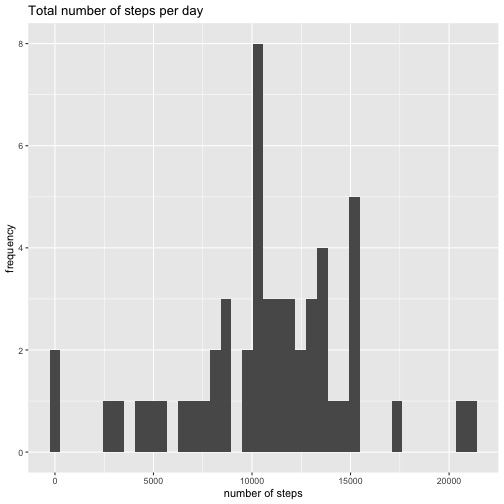
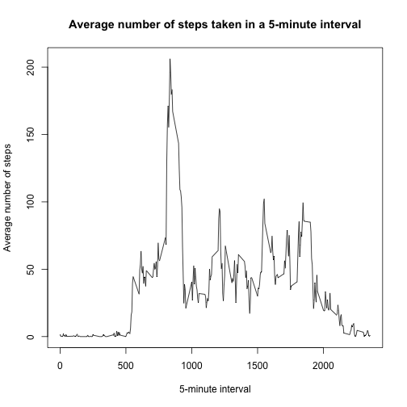
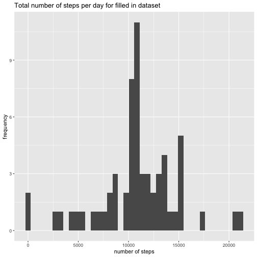
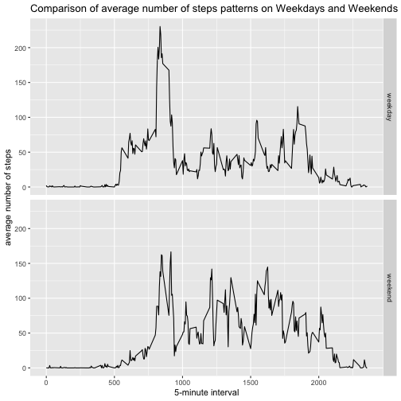

# Reproducible Research: Course Project 1

### Loading and processing the data
##### 1. Loading the data 


```r
if(!file.exists('activity.csv')) {
  unzip('activity.zip')
}
data <- read.csv('activity.csv')
```
##### 2. Processing the data

Convert dates to date format:

```r
data <- transform(data, date = as.Date(date))
```

Create a subset of data set ignoring the missing values:

```r
NonNaData <- data[!is.na(data[1]), ]
```

### What is mean total number of steps taken per day?

##### 1. Calculate the total steps taken per day

```r
DailySteps <- group_by(NonNaData, date)
DailySteps <- summarize(DailySteps, TotSteps = sum(steps))
```
##### 2. Make a histogram of the total number of steps taken each day

```r
qplot(
  TotSteps,
  data = DailySteps,
  xlab = "number of steps",
  bins = 40,
  ylab = "frequency",
  main = "Total number of steps per day"
)
```




##### 3. Calculate the mean and median of the total steps taken per day:

```r
MeanDailySteps <- mean(DailySteps$TotSteps)
MedianDailySteps <- median(DailySteps$TotSteps)
```

The mean and median of the total steps taken per day are 1.0766189 &times; 10<sup>4</sup> and 10765, respectively.

### What is the average daily activity pattern?

##### 1. Make a time series plot (i.e. type = "l) of the 5-minute interval (x-axis) and the average number of steps taken, averaged across all days (y-axis)


```r
IntervalSteps <- group_by(NonNaData, interval)
IntervalSteps <- summarize(IntervalSteps, MeanSteps = mean(steps))

plot(
  IntervalSteps$interval,
  IntervalSteps$MeanSteps,
  type = "l",
  xlab = "5-minute interval",
  ylab = "Average number of steps",
  main = "Average number of steps taken in a 5-minute interval"
)
```



##### 2. Which 5-minute interval, on average across all the days in the dataset, contains the maximum number of steps?

```r
MaxInterval <- IntervalSteps[IntervalSteps$MeanSteps ==
                               max(IntervalSteps$MeanSteps), ]$interval
```

The interval with the maximum average number of steps across all days is 835.

### Imputing missing values
There are a number of days/intervals where there are missing values. The presence of missing days may introduce bias into some calculations or summaries of the data.
##### 1. Calculate and report the total number of missing values in the dataset:

```r
CountMissingValues <- sum(is.na(data$steps))
```

The total number of missing values in the dataset is 2304.

##### 2. Devise a strategy for filling in all of the missing values in the dataset.

We are going to fill in the missing values using the mean of steps for that 5-minute interval. We have already calculated the mean of steps for each interval and stored as a *IntervalSteps* variable. 

##### 3. Create a new dataset `corrected_data` with missing data filled in:

```r
MergedData <- merge(data, IntervalSteps)
MergedData$steps[is.na(MergedData$steps)] <-
  MergedData$MeanSteps[is.na(MergedData$steps)]
corrected_data <- MergedData[, 1:3]
```

##### 4. Make a histogram of the total number of steps taken each day and Calculate and report the mean and median total number of steps taken per day. Do these values differ from the estimates from the first part of the assignment? What is the impact of imputing missing data on the estimates of the total daily number of steps?
First, calculate the total number of steps taken per day for the new dataset

```r
DailyStepsF <- group_by(corrected_data, date)
DailyStepsF <- summarize(DailyStepsF, TotSteps = sum(steps))
```
Then, make a histogram of the total number of steps taken each day for the new dataset with missing values filled in:

```r
qplot(
  TotSteps,
  data = DailyStepsF,
  xlab = "number of steps",
  bins = 40,
  ylab = "frequency",
  main = "Total number of steps per day for filled in dataset"
)
```



Calculate the mean and median of the total steps taken per day with the new filled in data:

```r
MeanDailyStepsF <- mean(DailyStepsF$TotSteps)
MedianDailyStepsF <- median(DailyStepsF$TotSteps)
```

The mean and median of the total steps taken per day are 1.0766189 &times; 10<sup>4</sup> and 1.0766189 &times; 10<sup>4</sup>, respectively. The mean and median in the original dataset were 1.0766189 &times; 10<sup>4</sup> and 10765. Means in both datasets are the same as we filled in missing values using the mean of known values. Medians are also very close, so filling in the missing values did not change the summary values significantly.

### Are there differences in activity patterns between weekdays and weekends?

##### 1. Create a new factor variable in the dataset with two levels – “weekday” and “weekend” indicating whether a given date is a weekday or weekend day.

```r
corrected_data$DayOfWeek <- as.factor(weekdays(corrected_data$date))
corrected_data$weekend <-
  as.factor(
    ifelse(
      corrected_data$DayOfWeek == "Saturday" |
        corrected_data$DayOfWeek == "Sunday",
      "weekend",
      "weekday"
    )
  )
```
##### 2. Make a panel plot containing a time series plot (i.e. type = "l") of the 5-minute interval (x-axis) and the average number of steps taken, averaged across all weekday days or weekend days (y-axis). See the README file in the GitHub repository to see an example of what this plot should look like using simulated data.

```r
MeanStepsWeekdayType <-
  corrected_data %>% group_by(interval, weekend) %>%   summarize(MeanSteps = mean(steps))
qplot(
  interval,
  MeanSteps,
  data = MeanStepsWeekdayType,
  geom = "line",
  facets = weekend ~ .,
  xlab = "5-minute interval",
  ylab = "average number of steps",
  main = "Comparison of average number of steps patterns on Weekdays and Weekends"
)
```


